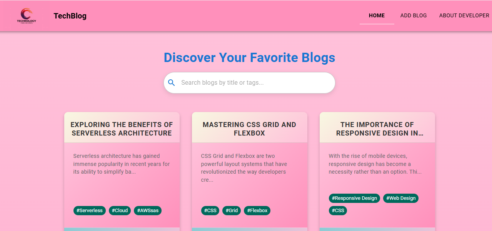
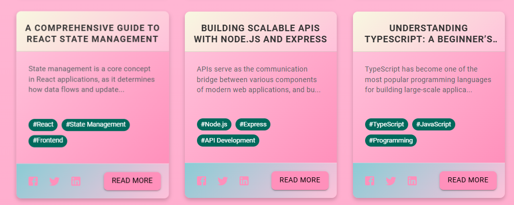
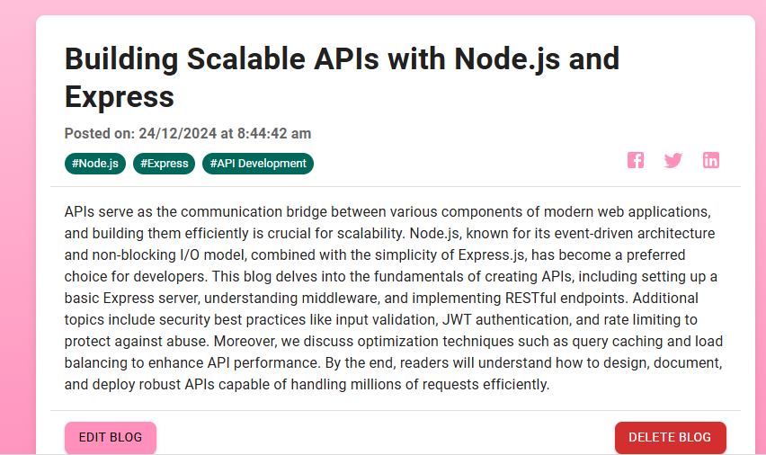

# TechBlog - Simple Blog Website

## Overview
DevBlogify is a simple and intuitive blogging platform where users can add, edit, share, and filter blogs. The project is built with a modern tech stack and provides a seamless user experience.

## What's New
- **Notifications Update:** Notifications now appear at the top of the page for improved visibility.
- **Accessibility Enhancements:** Improved features for better accessibility and usability.
- **Shimmering Effect:** Implemented a skeleton loader to improve UX while fetching data.

## Features
- **New Blog Indicator:** Highlights blogs added on the current date with a "New" tag.
- **Notifications:** Users receive notifications for creating or updating a blog post.
- **Share Blog:** A feature to share blogs easily.
- **Edit Blog:** Allows editing of existing blogs.
- **Filter Section:** Search blogs by title or tags for easy navigation.

## Tech Stack
- **Frontend:** React, TypeScript, Material UI
- **Backend:** Node.js, Express.js
- **Database:** SQLite
- **Styling Framework:** KendoReact (created using `create-kendoreact-app`)
- **Deployment:**
  - Backend deployed on Render
  - Frontend deployed on Vercel

## Installation and Setup

### Prerequisites
Ensure you have the following installed on your system:
- Node.js (v14 or later)
- npm or yarn

### Backend Setup
1.cd devblogify
   cd backend
   ```
2. Install dependencies:
   ```bash
   npm install
   ```
3. Start the backend server:
   ```bash
   npm start
   ```
   The server will run on `http://localhost:5000` by default(3000).

### Frontend Setup
1. Move to backend:
   ```bash
   cd ..
   cd backend
   ```
2. Install dependencies:
   ```bash
   npm install
   ```
3. Update the backend URL:
   Open `src/services/blogService.ts` and replace the backend URL with the localhost URL:
   ```typescript
   const BASE_URL = "http://localhost:5000";
   ```
4. Start the frontend application:
   ```bash
   npm start
   ```
   The application will be available at `http://localhost:3000`.

## Usage
1. Navigate to the homepage to view all blogs.
2. Use the "Add Blog" feature to create a new blog post.
3. Search for blogs using the filter section by entering a title or tag.
4. Click the "Edit" button to modify an existing blog.
5. Share a blog using the "Share" button available on each blog card.

## Deployment
- **Backend:** Hosted on Render - ensure your backend service URL is configured correctly.
- **Frontend:** Hosted on Vercel - you can access the live application via the deployed link.

## GitHub Repository
- [GitHub Profile](https://github.com/Yash-srivastav16)

## Acknowledgments
- **React** for building the frontend.
- **Material UI** for styling components.
- **SQLite** for lightweight and efficient database management.
- **Render & netlify** for deployment services.

## Screenshots

### Home Page


### Blog Details


### Add/Edit Blog


---
Feel free to reach out for any queries or contributions!
